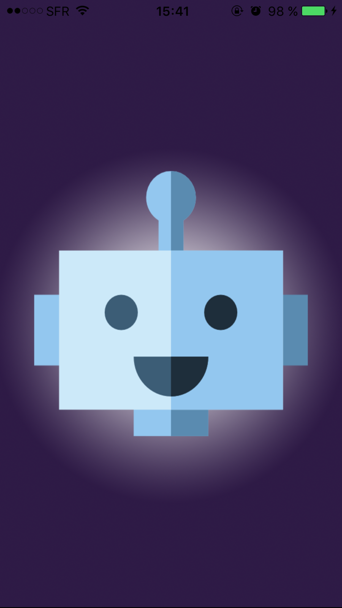
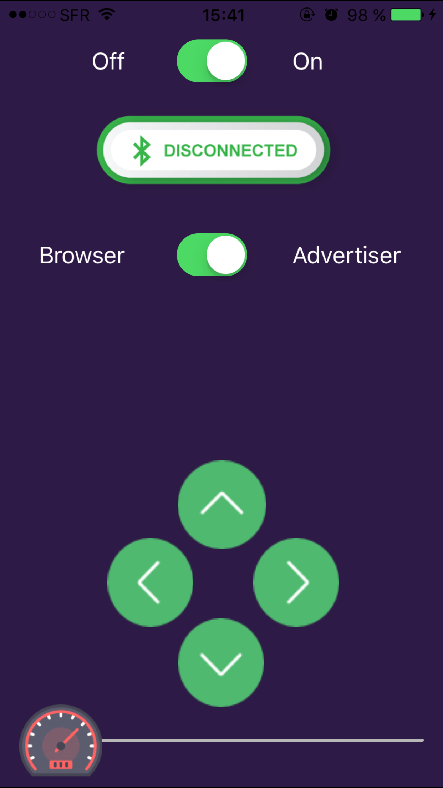

# Arduino-MBot-iPhones
A simple and basic iPhone Remote controller for iPhone with streaming video.

 

You need at least one iPhone but 2 will be better to stream video :
 - the first one for the camera attached to the bot
 - another one as a remote controller with video playback

I've just began this project, so this is not an even an alpha :)
When all features will be implemented, i'll rewrite the code and comment it.

## mBot custom firmware
You can find [here](https://github.com/YoannLeViavant/Arduino/tree/master/iPhone-BT) my custom firmware.

## References
- [Ray Wenderlich tutorial](https://www.raywenderlich.com/73306/arduino-tutorial-integrating-bluetooth-le-and-ios)
- MultiPeer connectivity by [Apple](https://www.youtube.com/watch?v=eNWOkm3e8qo&index=3&list=PLHdI2WEfrUznFdAYGgGF3IoJdWM6OtigZ)
- [AVCaptureMultipeerVideoDataOutput](https://github.com/pj4533/AVCaptureMultipeerVideoDataOutput)
- Icons made by [Freepik](http://www.freepik.com) from [www.flaticon.com](http://www.flaticon.com) is licensed by 
[Creative Commons BY 3.0](http://creativecommons.org/licenses/by/3.0/")

TODO:
- make the UI orientable
- optimize captureOuput conversions
